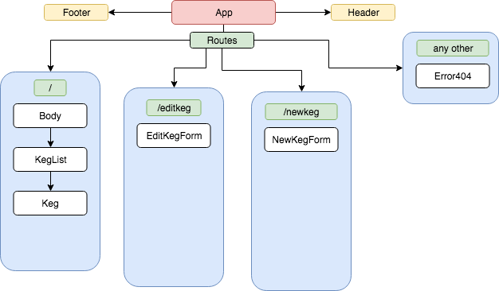

# Tap Room

#### Epicodus React Code Review, 9/07

#### By Elly Maimon

## Description
This project is a digital tap room initially built out in Angular, and recreated in React. The tap room lists different kegs of beer, and allows employees to sell pints, growlers, and large growlers while being notified of the remaining amount of beer remaining. It also allows employees to add/edit/delete kegs, and allows them to change their data or put them on sale. Users get a menu of the available kegs on tap and are able to sort/filter these kegs by their desired means.

#### Some thoughts regarding Angular vs. React Development:
* In Angular, components were responsible for specific functions of the application, whereas in React, components are representations of single UI/UX elements. Because of this, React feels more modular thus far. Angular, being a framework, seemed to guide the structure of the project with a heavier hand than React does. Also, being able to JS in conjunction with rendering HTML elements (JSX) feels more powerful than using angular directives directly in the HTML.

## Component Tree

## User Stories
* As a patron, I want to see a list/menu of all available kegs. For each keg, I need to see its name, brand, price and alcoholContent.
* As an employee, I want to fill out a form when I tap a new keg to add it to the list.
* As an employee, I want the option to edit a keg's properties after entering them.
* As a patron and/or employee, I want to see how many pints are left in a keg. (124 pints per keg).
* As an employee, I want to be able to click a button next to a keg whenever I sell a pint of it.
* As an employee, I want to be able to see kegs with less than 20 pints left so I can be ready to change them.
* As a patron, I want keg prices to be color-coded for easy readability.
* As a patron, I want to use the alcohol content property to display stronger beers differently than weaker beers.
* As an employee, I want to be able to click a button next to a keg whenever I sell a growler of it. (2 Pints)
* As an employee, I want to be able to click a button next to a keg whenever I sell a large growler. (4 Pints)
* As a patron, I want to filter the available kegs by style or flavor of beer.
* As an employee, I want to select an option to put a certain keg on sale.
* As an employee, I might want to program a "happy hour" option I can select to put all kegs on sale.
* As an employee, I might want to trigger the "happy hour" option automatically at a certain time of the day or week.

## Setup on OSX

* Clone the repository
* Run `npm install`
* Run `npm run start`

## Technologies Used

* ReactJS
* React Router
* JavaScript (ES6)
* Node.js
* Node Package Manager (Npm)
* Babel Transpiler
* Webpack

## Links

* [Github Repo] (https://github.com/ellymaimon/tap-room-react)

## Notes
* How will I be able to change the number of pints in a keg using React?
* Assuming state will play a big part in the interactivity of the app.

## License

This software is licensed under the MIT license.

Copyright (c) 2018 **Elly Maimon**